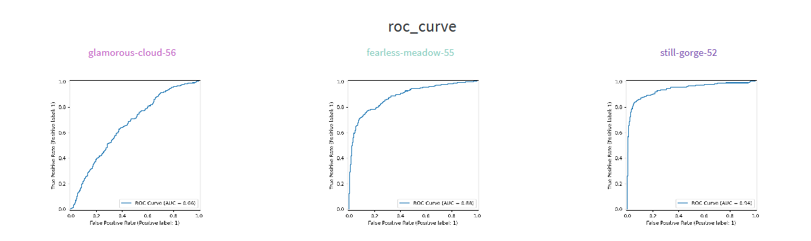
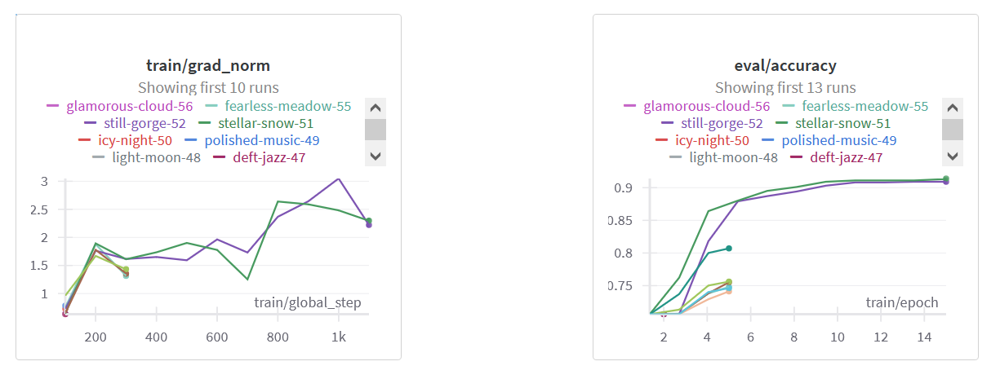
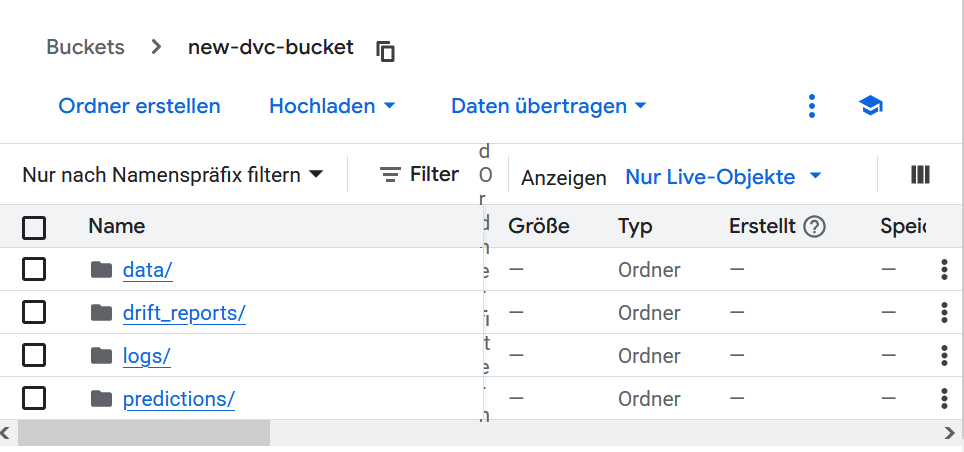
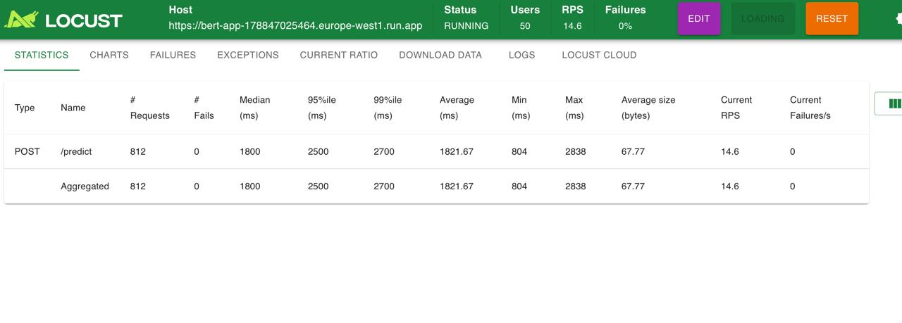
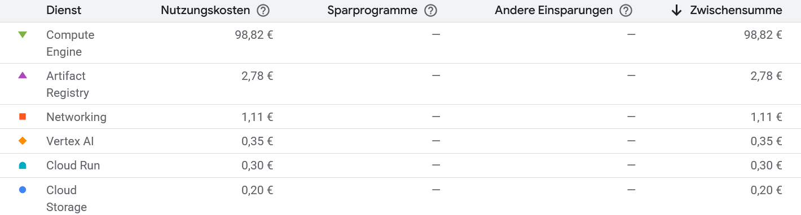
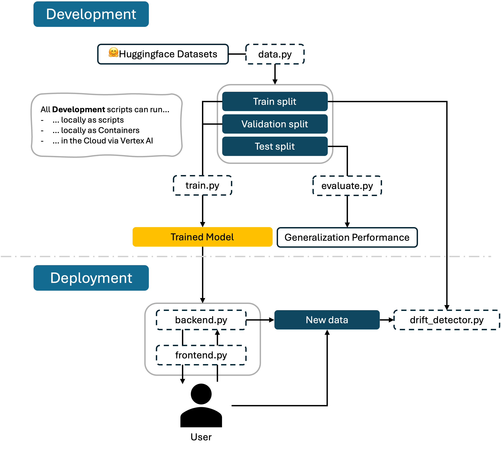

## Overall project checklist

The checklist is *exhaustive* which means that it includes everything that you could do on the project included in the
curriculum in this course. Therefore, we do not expect at all that you have checked all boxes at the end of the project.
The parenthesis at the end indicates what module the bullet point is related to. Please be honest in your answers, we
will check the repositories and the code to verify your answers.

### Week 1

* [x] Create a git repository (M5)
* [x] Make sure that all team members have write access to the GitHub repository (M5)
* [x] Create a dedicated environment for you project to keep track of your packages (M2)
* [x] Create the initial file structure using cookiecutter with an appropriate template (M6)
* [x] Fill out the `data.py` file such that it downloads whatever data you need and preprocesses it (if necessary) (M6)
* [x] Add a model to `model.py` and a training procedure to `train.py` and get that running (M6)
* [x] Remember to fill out the `requirements.txt` and `requirements_dev.txt` file with whatever dependencies that you
    are using (M2+M6)
* [x] Remember to comply with good coding practices (`pep8`) while doing the project (M7)
* [x] Do a bit of code typing and remember to document essential parts of your code (M7)
* [x] Setup version control for your data or part of your data (M8)
* [x] Add command line interfaces and project commands to your code where it makes sense (M9)
* [x] Construct one or multiple docker files for your code (M10)
* [x] Build the docker files locally and make sure they work as intended (M10)
* [x] Write one or multiple configurations files for your experiments (M11)
* [x] Used Hydra to load the configurations and manage your hyperparameters (M11)
* [ ] Use profiling to optimize your code (M12)
* [x] Use logging to log important events in your code (M14)
* [x] Use Weights & Biases to log training progress and other important metrics/artifacts in your code (M14)
* [x] Consider running a hyperparameter optimization sweep (M14)
* [ ] Use PyTorch-lightning (if applicable) to reduce the amount of boilerplate in your code (M15)

### Week 2

* [x] Write unit tests related to the data part of your code (M16)
* [x] Write unit tests related to model construction and or model training (M16)
* [x] Calculate the code coverage (M16)
* [x] Get some continuous integration running on the GitHub repository (M17)
* [x] Add caching and multi-os/python/pytorch testing to your continuous integration (M17)
* [x] Add a linting step to your continuous integration (M17)
* [x] Add pre-commit hooks to your version control setup (M18)
* [x] Add a continues workflow that triggers when data changes (M19)
* [ ] Add a continues workflow that triggers when changes to the model registry is made (M19)
* [x] Create a data storage in GCP Bucket for your data and link this with your data version control setup (M21)
* [ ] Create a trigger workflow for automatically building your docker images (M21)
* [x] Get your model training in GCP using either the Engine or Vertex AI (M21)
* [x] Create a FastAPI application that can do inference using your model (M22)
* [x] Deploy your model in GCP using either Functions or Run as the backend (M23)
* [x] Write API tests for your application and setup continues integration for these (M24)
* [x] Load test your application (M24)
* [x] Create a more specialized ML-deployment API using either ONNX or BentoML, or both (M25)
* [x] Create a frontend for your API (M26)

### Week 3

* [x] Check how robust your model is towards data drifting (M27)
* [ ] Deploy to the cloud a drift detection API (M27)
* [x] Instrument your API with a couple of system metrics (M28)
* [x] Setup cloud monitoring of your instrumented application (M28)
* [x] Create one or more alert systems in GCP to alert you if your app is not behaving correctly (M28)
* [ ] If applicable, optimize the performance of your data loading using distributed data loading (M29)
* [ ] If applicable, optimize the performance of your training pipeline by using distributed training (M30)
* [x] Play around with quantization, compilation and pruning for you trained models to increase inference speed (M31)

### Extra

* [x] Write some documentation for your application (M32)
* [x] Publish the documentation to GitHub Pages (M32)
* [x] Revisit your initial project description. Did the project turn out as you wanted?
* [x] Create an architectural diagram over your MLOps pipeline
* [x] Make sure all group members have an understanding about all parts of the project
* [x] Uploaded all your code to GitHub

## Group information

### Question 1
> **Enter the group number you signed up on <learn.inside.dtu.dk>**

Group A

### Question 2
> **Enter the study number for each member in the group**

12371375, 12590611

### Question 3
> **A requirement to the project is that you include a third-party package not covered in the course. What framework**
> **did you choose to work with and did it help you complete the project?**
>
> Answer

We used the widely known and popular Huggingface package `transformers` as third-party package in our project. We leveraged functionality for loading pretrained models and tokenizers from the package to do text classification in our project. The package also provided us with a lot of documentation and examples which helped us to quickly get started with our project. Additionally, we used the datasets package from Huggingface to load the dataset we used for training our model. The big variety of models enabled us to use a lightweight model that was able to run on our local machines without the need for a GPU.

## Coding environment

> In the following section we are interested in learning more about you local development environment. This includes
> how you managed dependencies, the structure of your code and how you managed code quality.

### Question 4

> **Explain how you managed dependencies in your project? Explain the process a new team member would have to go**
> **through to get an exact copy of your environment.**
>
> Answer:

We used pip for managing our dependencies. We managed dependencies using a combination of a `pyproject.toml` file and separate requirements.txt files, which we have continuously updated during the project: The `requirements.txt` file contains the packages needed to run the code, the `requirements_dev.txt` file contains the packages needed for development (e.g. ruff, precommit) and the `requirements_test.txt` file contains the packages needed for testing (e.g. pytest).The `pyproject.toml` includes project dynamic dependency declarations that reference our requirements.txt and requirements_dev.txt files. This setup allows us to build and install the project with setuptools in a clean and standardized way.

To reproduce our exact development environment, one would have to run the following commands:

```bash
conda create -n hatespeech_env python=3.11
conda activate hatespeech_env
pip install -e .
pip install -r requirements_dev.txt
pip install -r requirements_tests.txt
```

You can also use invoke which is cool for commonly used commands. Try:
```bash
pip install invoke
invoke create-environment
invoke requirements
invoke dev-requirements
invoke test-requirements
```

### Question 5

> **We expect that you initialized your project using the cookiecutter template. Explain the overall structure of your**
> **code. What did you fill out? Did you deviate from the template in some way?**
>
> Answer


From the cookiecutter template we have filled out the `src`, `reports`, `data` and `tests` folder. We have removed the `docs` folder and the `notebooks` folder because we did not use any documentation or notebooks in our project. We also added a `cloud` folder, which contains yaml files with cloudbuild configurations and vertex AI configurations. The most relevant deviation from the template is that we have added a `logs` folder that contains trained model checkpoints and evaluation results.


### Question 6

> **Did you implement any rules for code quality and format? What about typing and documentation? Additionally,**
> **explain with your own words why these concepts matters in larger projects.**
> Answer:

We used `ruff` for linting. Additionally we did typing and we documented our code consistently. These concepts are important in larger projects because they help to maintain code quality and readability. They are also helpful to better understand the code and to avoid bugs.

## Version control

> In the following section we are interested in how version control was used in your project during development to
> corporate and increase the quality of your code.

### Question 7

> **How many tests did you implement and what are they testing in your code?**
>
> Recommended answer length: 50-100 words.
>
> Answer:

We implemented 4 automatic tests in our code which we divided in two categories: Unit tests and integration tests. The unit tests are testing the data loading, preprocessing and the the model training. The integration tests are testing wether the API of the backend (app.py) is working properly and as intended. The tests are run automatically using continuous integration on GitHub whenever we create a pull request or commit code to the main branch. The tests can also run locally using pytest.
Furthermore we wrote a load test script (locustfile.py) which can simulate a load test of multiple users accessing the API at the same time. This script is not run automatically but can be run locally by any group member.

### Question 8

> **What is the total code coverage (in percentage) of your code? If your code had a code coverage of 100% (or close**
> **to), would you still trust it to be error free? Explain you reasoning.**
>
> Recommended answer length: 100-200 words.
>
> Answer:

The total code coverage of our code is 37% since some parts of our code are not covered by tests. We are far from 100% coverage of our code and even if we were then we would not trust it to be error free. The reason for this is that code coverage only measures how much of the code is executed during the tests, but it does not measure wether the code is error free or not. So it's possible to have a high code coverage, but still have bugs in the code.

### Question 9

> **Did you workflow include using branches and pull requests? If yes, explain how. If not, explain how branches and**
> **pull request can help improve version control.**
>
> Recommended answer length: 100-200 words.
>
> Answer:

We made use of both branches and pull requests in our project. In particular, we created for each task an issue on GitHub which contains a check list of smaller parts of the task. The issues were then assigned to a group member who would then create a branch and link the issue to the branch. When the task was completed, the group member would create a pull request to merge the branch into the main branch. The continuous integration would then run tests. The pull request should only be merged if all tests passed. This way we wanted to ensure that the main branch was always in a working state. We could have improved this workflow further by requiring that another group member reviewed the pull request before merging it. Moreover we could have protected the main branch such that it could not be merged into without a reviewed pull request or without successfully passing the continuous integration tests.

### Question 10

> **Did you use DVC for managing data in your project? If yes, then how did it improve your project to have version**
> **control of your data. If no, explain a case where it would be beneficial to have version control of your data.**
>
> Recommended answer length: 100-200 words.
>
> Answer:

We used DVC for tracking our data (`processed.dvc`) and model checkpoints (`run1.dvc`). Some of our containerized scripts (train.py, data.py and evaluate.py) use dvc pull and push in the corresponding yaml files to automatically pull the data and model checkpoints from the DVC remote storage. This way we can ensure that the data and model checkpoints are always in sync with the code.

### Question 11

> **Discuss you continuous integration setup. What kind of continuous integration are you running (unittesting,**
> **linting, etc.)? Do you test multiple operating systems, Python  version etc. Do you make use of caching? Feel free**
> **to insert a link to one of your GitHub actions workflow.**
>
> Recommended answer length: 200-300 words.
>
> Answer:

We have organized our continuous integration into 2 separate files: one for doing unit testing and one for running linting. For the unit testing we used pytest and for the linting we used ruff. We also made use of caching to speed up the continuous integration and we use multiple operating systems (Linux, MacOS and Windows). We also implemented a workflow that triggers when data changes.
Moreover, we added code coverage to our unit tests using the `coverage` package. The code coverage is then reported to Codecov and also a part of the continuous integration workflow with GitHub Actions.

## Running code and tracking experiments

> In the following section we are interested in learning more about the experimental setup for running your code and
> especially the reproducibility of your experiments.

### Question 12

> **How did you configure experiments? Did you make use of config files? Explain with coding examples of how you would**
> **run a experiment.**
>
> Answer:

The most relevant instance here is our train.py since it contains a lot of hyperparameters. We used a config file for reproducibility (see next section). We have configured the training script such that it can be run with a command line interface. The following command would run the training script with 10 epochs:

```bash
train --epochs 10
```

### Question 13

> **Reproducibility of experiments are important. Related to the last question, how did you secure that no information**
> **is lost when running experiments and that your experiments are reproducible?**
>
> Answer:

We configured our experiments using Hydra, which allowed us to manage hyperparameters for our training script via a yaml config file. This made it easy to reproduce experiments and switch between configurations.

### Question 14

> **Upload 1 to 3 screenshots that show the experiments that you have done in W&B (or another experiment tracking**
> **service of your choice). This may include loss graphs, logged images, hyperparameter sweeps etc. You can take**
> **inspiration from [this figure](figures/wandb.png). Explain what metrics you are tracking and why they are**
> **important.**
>
> Answer:

In our project, we used W&B to track and visualize our experiments. We logged metrics as well as models and visualizations.

As seen in the first image, we logged a ROC curve during validation. The first curve is the ROC of a model trained with 2 epochs, while the second was trained with 5 epochs and the third with 15 epochs. The ROC curve is a metric used for binary classification tasks and therefore relevant for our hate speech detection model. We also tracked metrics such as accuracy and F1-score during evaluation. The F1-score is particularly important for this task due to the class imbalance in our dataset.

In the second image you can see the gradient norm during training in the first panel and the evaluation accuracy in the second panel. It is visible to see that the accuracy increases with the number of epochs.

In addition to metrics and plots, we logged the final trained model as a W&B artifact, along with metadata such as evaluation scores. We also documented key hyperparameters such as learning rate, weight decay and number of epochs through W&B’s configuration tracking.




### Question 15

> **Docker is an important tool for creating containerized applications. Explain how you used docker in your**
> **experiments/project? Include how you would run your docker images and include a link to one of your docker files.**
>
> Answer:

For our project we developed 6 docker images: one for data preprocessing, one for training, one for evaluation, two for the deployment backends (app.dockerfile and bento.dockerfile) and one for the frontend. Note that our actual application uses the app.dockerfile for deployment, but we also created a bento.dockerfile for testing purposes. For the latter we have a very slim image which even contains an onnx model.

For instance, have a look at our at our BentoML App which is lightweight (small container). Note that this is only the backend.
To pull the docker images, you can use the following command:

```bash
docker pull --platform=linux/amd64 europe-west1-docker.pkg.dev/mlops-hatespeech/hs-images/bento-app:latest
```

To run the docker image on a Mac, you can use the following command:

```bash
docker run --rm \
  --platform=linux/amd64 \
  -p 3000:3000 \
  europe-west1-docker.pkg.dev/mlops-hatespeech/hs-images/bento-app:latest
```

### Question 16

> **When running into bugs while trying to run your experiments, how did you perform debugging? Additionally, did you**
> **try to profile your code or do you think it is already perfect?**
>
> Answer:

We didn’t encounter major bugs during our experiments, but when smaller issues came up we primarily used logging and print statements to solve them. Since we used Hugging Face’s Trainer class, much of the training pipeline was already well-optimized.

## Working in the cloud

> In the following section we would like to know more about your experience when developing in the cloud.

### Question 17

> **List all the GCP services that you made use of in your project and shortly explain what each service does?**
>
> Answer:

We made use of the following GCP services:
- **Cloud Storage**: Store data, reports, model weights, user requests
- **Artifact Registry**: Store all docker images
- **Cloud Build**: Build docker images and trigger workflows
- **Vertex AI**: Train models (we also abused this for evaluate.py and data.py)
- **Cloud Run**: Deploy the API
- **Secret Manager**: Store secrets like the WANDB_API_KEY

### Question 18

> **The backbone of GCP is the Compute engine. Explained how you made use of this service and what type of VMs**
> **you used?**
>
> Answer:

We used custom Vertex AI Jobs which internally rely on Google Cloud Compute Engine. They're cool since they combine multiple steps into one: Create VM, loads container, runs it. For this we implemented containerized jobs, pulled from the artifact registry. Note that we also abused those Vertex AI Jobs to run our data preprocessing and evaluation scripts. Our Machine Type always were n1-highmem-2. We specified a service-account eligible for Vertex AI and Artifact Registry access.


### Question 19

> **Insert 1-2 images of your GCP bucket, such that we can see what data you have stored in it.**
> **You can take inspiration from [this figure](figures/bucket.png).**
>
> Answer:




### Question 20

> **Upload 1-2 images of your GCP artifact registry, such that we can see the different docker images that you have**
> **stored. You can take inspiration from [this figure](figures/registry.png).**
>
> Answer:


### Question 21

> **Upload 1-2 images of your GCP cloud build history, so we can see the history of the images that have been build in**
> **your project. You can take inspiration from [this figure](figures/build.png).**
>
> Answer:


### Question 22

> **Did you manage to train your model in the cloud using either the Engine or Vertex AI? If yes, explain how you did**
> **it. If not, describe why.**
>
> Answer:

Our model training can be executed hierarchically, meaning that we use the same train.dockerfile for the cloud as for local execution. Since the training requires a WANDB_API_KEY environment variable, the vertex AI job a two-stage process with one stage including a placeholder in the vertex config file and the other stage starting a temporary alpine (lightweight and only necessities) container injecting the secret from the GCP secret manager. The second stage then runs the training script with the WANDB_API_KEY environment variable set. All custom jobs can be seen in Vertex AI > Training > Custom Jobs > select correct region

## Deployment

### Question 23

> **Did you manage to write an API for your model? If yes, explain how you did it and if you did anything special. If**
> **not, explain how you would do it.**
>
> Answer:

We have two apps for demonstration purposes: One uses FastAPI and the other uses BentoML. The FastAPI app is implemented in `app.py` and the BentoML app is implemented in `bento_app.py`. The FastAPI app is a simple API that takes a text input and returns a prediction of whether the text is hateful or not. We also added a frontend for this one using Streamlit, which allows users to interact with the API in a more user-friendly way. Both apps are containerized using Docker and can be deployed in the cloud using Cloud Run. The FastAPI app is also able to log the predictions to the Cloud Bucket relevant for data drift detection.

### Question 24

> **Did you manage to deploy your API, either in locally or cloud? If not, describe why. If yes, describe how and**
> **preferably how you invoke your deployed service?**
>
> Answer:

We deployed our app locally using Docker and in the cloud using Cloud Run. The local deployment can be done by running the following command (assuming you have the docker image pulled with the command shown above):

```bash
docker run --rm \
  --platform=linux/amd64 \
  -p 3000:3000 \
  europe-west1-docker.pkg.dev/mlops-hatespeech/hs-images/bento-app:latest
```

With the above command, the app starts locally.

Try the backend API with the following link:
[https://bento-app-178847025464.europe-west1.run.app](https://bento-app-178847025464.europe-west1.run.app)

Note that it might a while since our deployment is request based and a Kaltstart is required.


### Question 25

> **Did you perform any unit testing and load testing of your API? If yes, explain how you did it and what results for**
> **the load testing did you get. If not, explain how you would do it.**
>
> Answer:

We performed unit testing of our API using pytest and load testing using Locust. The unit tests can be run using the command `pytest`.

The results of load testing showed that the API does not crash under high load, but the average response time slightly increases when the number of users increases.



### Question 26

> **Did you manage to implement monitoring of your deployed model? If yes, explain how it works. If not, explain how**
> **monitoring would help the longevity of your application.**
>
> Answer:

We implemented basic monitoring for our deployed model using the prometheus_client library to expose a /metrics endpoint from our FastAPI app. The key metric we track is a prediction_error counter, which increments whenever the model or tokenizer fails to load, or an exception occurs during inference. This allows us to keep track of runtime issues such as model unavailability or invalid inputs.

## Overall discussion of project

> In the following section we would like you to think about the general structure of your project.

### Question 27

> **How many credits did you end up using during the project and what service was most expensive? In general what do**
> **you think about working in the cloud?**
>
> Answer:

The total cost of our project was approximately 104 €. The most expensive service was the Compute Engine, as one group member accidentally left a virtual machine running, which caused unexpectedly high costs. The second most expensive service was the Artifact Registry, which accounted for 2,78 €.
The exact distribution of costs can be seen in the figure below.
Working in the cloud was a valuable experience, since we were able to use its resources to train our model and deploy our app.
However, we also encountered some challenges, such as debugging cloud issues and managing secrets in the cloud. And we think that the Google Cloud Platform is not always the most user-friendly platform, especially for beginners. Moreover, the free Google Cloud Trial does not include GPU resources, which limited our ability to experiment with larger models or faster training.




### Question 28

> **Did you implement anything extra in your project that is not covered by other questions? Maybe you implemented**
> **a frontend for your API, use extra version control features, a drift detection service, a kubernetes cluster etc.**
> **If yes, explain what you did and why.**
>
> Answer:

We implemented a frontend for our app that allows users to interact with the API in a more user-friendly way. The frontend is implemented using Streamlit and is able to send requests to the API and display the results. We also added a drift detection service that monitors the requests including input and prediction of the API and logs them to the Cloud Bucket. This allows us to detect if the data is drifting over time. The drift detection looks at the embeddings, keywords and class frequencies of the requests and compares them to the training data.


### Question 29

> **Include a figure that describes the overall architecture of your system and what services that you make use of.**
> **You can take inspiration from [this figure](figures/overview.png). Additionally, in your own words, explain the**
> **overall steps in figure.**
>
> Answer:

The starting point is our local development environment, where we developed the core components of the hate speech detection pipeline using Python. This includes modules for data preprocessing, model training, and evaluation. All source code is stored in a modular src/ structure.

For data versioning, we use DVC. Our processed data, as well as trained model checkpoints and logs, are tracked using DVC. These large artifacts are stored in Google Cloud Storage buckets.

Model training is tracked using Weights & Biases. Each training run is logged automatically, including metrics, loss curves, and hyperparameters.

To ensure code quality, we use pre-commit hooks that run linters.
When changes are committed and pushed to GitHub, GitHub Actions triggers our CI pipeline. This includes running unit tests, performing code style checks, calculating test coverage, which is reported using Codecov and building and deploying the documentation using mkdocs and mkdocs-material to GitHub Pages.



### Question 30

> **Discuss the overall struggles of the project. Where did you spend most time and what did you do to overcome these**
> **challenges?**
>
> Answer:

Everything is harder in the cloud. For some things you need to wait for a long time for some sequential jobs to finish only to see that they might have failed. Therefore debugging the cloud was one of the biggest challenges in the project. Secret management was also challenging; especially the complex training job relies on correctly injecting all credentials, i.e. the wandb-key or linking the data storage correctly with the right servie account. Lastly: Resources. Docker can be intense to build, especially on Windows machines. One team member could not build docker images locally, which made it difficult to test the code locally.

### Question 31

> **State the individual contributions of each team member. This is required information from DTU, because we need to**
> **make sure all members contributed actively to the project. Additionally, state if/how you have used generative AI**
> **tools in your project.**
>
> Answer:


Student 12371375 set up the continuous integration and wrote most of the unit tests. They also calculate the code coverage, Wandb logging and sweeping.
Student 12590611 was in charge of Docker, the cloud setup and the deployment of the APIs.
General documentation and code maintenance was done by both team members.
We have used ChatGPT to help debug our code and GitHub Copilot to help write some of our code.
